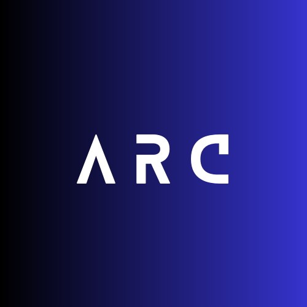

  
  <h1>ARC: hub1</h1>
  <b>Open source code for Arc’s hub1</b>

---

## What is [hub1](#)

hub1 is the first Arc hub release. This first smart assisant is lightweight and developed open-source. It is developed using an esp32 board and more components.

## License

ARC: hub1 is under the [MIT License](LICENSE).
